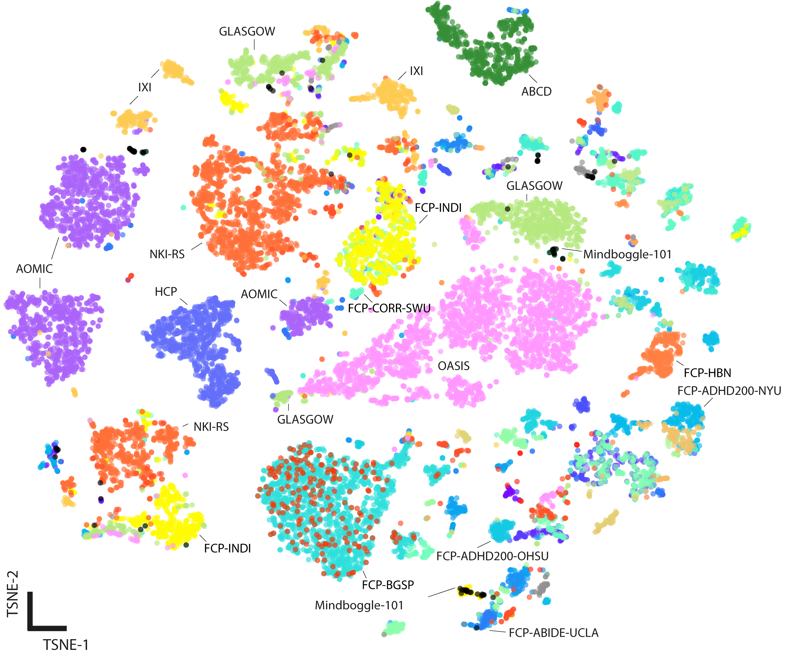

[<-- main page](https://rocknroll87q.github.io/LOD-Brain/)

# Dataset

To address the brain MRI huge variability in intensity statistics and scanning artifacts, we collected almost 27,000 brain T1-weighted volumes of both healthy and clinical subjects, released in 78 databases covering at least 155 different world sites.

<!--

  

-->

*A visualisation by t-SNE of the 68 MRIQC features (different colors for different datasets). Note that one dataset (\textit{e.g.}, IXI in yellow color) may contain volumes from more than one site, and thus split in separate clusters in the t-SNE feature space.*

| Dataset | Country | Cardinality | Age (mean +/- std) | Sex (F/M) | SliceThickness | Manufacturer | MagneticFieldStrength | ManufacturerModel |
| ----------- | ----------- | ----------- | ----------- | ----------- | ----------- | ----------- | ----------- | ----------- |
| 1000\_FCP\_ABIDE\_CMU | United States | 27 | 26.59 +/- 5.58 | F:6/M:21 | n.a. | n.a. | n.a. | n.a. |
| 1000\_FCP\_ABIDE\_Caltech | United States | 36 | 28.09 +/- 10.60 | F:8/M:28 | n.a. | n.a. | n.a. | n.a. |
| 1000\_FCP\_ABIDE\_KKI | United States | 49 | 10.08 +/- 1.34 | F:13/M:36 | n.a. | n.a. | n.a. | n.a. |
| 1000\_FCP\_ABIDE\_Leuven | Belgium | 62 | 17.99 +/- 4.91 | F:7/M:55 | n.a. | n.a. | n.a. | n.a. |
| 1000\_FCP\_ABIDE\_MaxMun | Germany | 50 | 24.56 +/- 10.48 | F:7/M:43 | n.a. | n.a. | n.a. | n.a. |
| 1000\_FCP\_ABIDE\_NYU | United States | 182 | 15.31 +/- 6.57 | F:37/M:145 | n.a. | n.a. | n.a. | n.a. |
| 1000\_FCP\_ABIDE\_OHSU | United States | 27 | 10.67 +/- 1.73 | M:27 | n.a. | n.a. | n.a. | n.a. |
| 1000\_FCP\_ABIDE\_Olin | United States | 30 | 17.30 +/- 3.34 | F:5/M:25 | n.a. | n.a. | n.a. | n.a. |
| 1000\_FCP\_ABIDE\_Pitt | United States | 54 | 18.86 +/- 6.97 | F:7/M:47 | n.a. | n.a. | n.a. | n.a. |
| 1000\_FCP\_ABIDE\_SBL | Netherlands | 29 | 33.34 +/- 6.53 | M:29 | n.a. | n.a. | n.a. | n.a. |
| 1000\_FCP\_ABIDE\_SDSU | United States | 29 | 14.36 +/- 1.88 | F:6/M:23 | n.a. | n.a. | n.a. | n.a. |
| 1000\_FCP\_ABIDE\_Stanford | United States | 37 | 9.91 +/- 1.56 | F:8/M:29 | n.a. | n.a. | n.a. | n.a. |
| 1000\_FCP\_ABIDE\_Trinity | Ireland | 46 | 17.48 +/- 3.51 | M:46 | n.a. | n.a. | n.a. | n.a. |
| 1000\_FCP\_ABIDE\_UCLA | United States | 88 | 13.12 +/- 2.22 | F:12/M:76 | n.a. | n.a. | n.a. | n.a. |
| 1000\_FCP\_ABIDE\_UM | United States | 119 | 14.19 +/- 3.30 | F:26/M:93 | n.a. | n.a. | n.a. | n.a. |
| 1000\_FCP\_ABIDE\_USM | United States | 97 | 22.32 +/- 7.72 | M:97 | n.a. | n.a. | n.a. | n.a. |
| 1000\_FCP\_ABIDE\_Yale | United States | 48 | 12.81 +/- 2.90 | F:16/M:32 | n.a. | n.a. | n.a. | n.a. |
| 1000\_FCP\_ACPI | United States | 159 | nan +/- nan | F:40/M:119 | 1.0,1.9 | GE,SIEMENS | 3T | MAGNETOM TrioTim,Signa Excite |
| 1000\_FCP\_ADHD200\_Brown | United States | 24 | 14.42 +/- 2.55 | F:17/M:7 | n.a. | n.a. | n.a. | n.a. |
| 1000\_FCP\_ADHD200\_KKI | United States | 76 | 10.26 +/- 1.33 | F:32/M:44 | n.a. | n.a. | n.a. | n.a. |
| 1000\_FCP\_ADHD200\_NYU | United States | 246 | 11.50 +/- 2.95 | F:89/M:156 | n.a. | n.a. | n.a. | n.a. |
| 1000\_FCP\_ADHD200\_NeuroIMAGE | Netherlands | 69 | 17.63 +/- 3.09 | F:30/M:39 | n.a. | n.a. | n.a. | n.a. |
| 1000\_FCP\_ADHD200\_OHSU | United States | 102 | 9.18 +/- 1.25 | F:47/M:55 | n.a. | n.a. | n.a. | n.a. |
| 1000\_FCP\_ADHD200\_Peking | China | 241 | 11.68 +/- 1.94 | F:71/M:170 | n.a. | n.a. | n.a. | n.a. |
| 1000\_FCP\_ADHD200\_Pittsburgh | United States | 98 | 15.08 +/- 2.77 | F:45/M:53 | n.a. | n.a. | n.a. | n.a. |
| 1000\_FCP\_ADHD200\_WashU | United States | 48 | 11.37 +/- 3.61 | F:23/M:25 | n.a. | n.a. | n.a. | n.a. |
| 1000\_FCP\_BGSP | United States | 1552 | 21.54 +/- 2.90 | F:904/M:648 | 1.2 | SIEMENS | 3T | MAGNETOM TimTrio |
| 1000\_FCP\_CORR\_BMB | Germany | 50 | 30.83 +/- 7.02 | F:26/M:24 | n.a. | n.a. | n.a. | n.a. |
| 1000\_FCP\_CORR\_BNU | China | 165 | 22.28 +/- 1.98 | F:79/M:86 | n.a. | n.a. | n.a. | n.a. |
| 1000\_FCP\_CORR\_DC | n.a. | 102 | nan +/- nan |  | n.a. | n.a. | n.a. | n.a. |
| 1000\_FCP\_CORR\_HNU | China | 30 | 24.37 +/- 2.37 | F:15/M:15 | n.a. | n.a. | n.a. | n.a. |
| 1000\_FCP\_CORR\_IACAS | China | 27 | 26.48 +/- 4.97 | F:15/M:12 | n.a. | n.a. | n.a. | n.a. |
| 1000\_FCP\_CORR\_IBA\_TRT | United States | 34 | 27.41 +/- 7.96 | F:17/M:17 | n.a. | n.a. | n.a. | n.a. |
| 1000\_FCP\_CORR\_IPCAS | China | 209 | nan +/- nan | F:114/M:91 | n.a. | n.a. | n.a. | n.a. |
| 1000\_FCP\_CORR\_JHNU | China | 30 | 23.27 +/- 3.63 | F:9/M:21 | n.a. | n.a. | n.a. | n.a. |
| 1000\_FCP\_CORR\_LMU | Germany | 90 | 47.81 +/- 23.08 | F:45/M:45 | n.a. | n.a. | n.a. | n.a. |
| 1000\_FCP\_CORR\_MRN | United States | 53 | nan +/- nan | F:25/M:27 | n.a. | n.a. | n.a. | n.a. |
| 1000\_FCP\_CORR\_NKI\_TRT | United States | 21 | 31.67 +/- 10.96 | F:21 | n.a. | n.a. | n.a. | n.a. |
| 1000\_FCP\_CORR\_NYU | United States | 204 | 21.46 +/- 11.68 | F:82/M:122 | n.a. | n.a. | n.a. | n.a. |
| 1000\_FCP\_CORR\_SWU | China | 306 | nan +/- nan | F:162/M:142 | n.a. | n.a. | n.a. | n.a. |
| 1000\_FCP\_CORR\_UM | Canada | 78 | 65.50 +/- 6.22 | F:57/M:21 | n.a. | n.a. | n.a. | n.a. |
| 1000\_FCP\_CORR\_UPSM | United States | 93 | 15.18 +/- 2.79 | F:46/M:47 | n.a. | n.a. | n.a. | n.a. |
| 1000\_FCP\_CORR\_UWM | United States | 25 | 24.96 +/- 3.17 | F:11/M:14 | n.a. | n.a. | n.a. | n.a. |
| 1000\_FCP\_CORR\_XHCUMS | China | 25 | nan +/- nan | F:10/M:14 | n.a. | n.a. | n.a. | n.a. |
| 1000\_FCP\_FCON1000\_AnnArbor | United States | 57 | nan +/- nan | F:20/M:37 | n.a. | n.a. | 3T | n.a. |
| 1000\_FCP\_FCON1000\_Atlanta | United States | 27 | 30.78 +/- 9.87 | F:15/M:12 | n.a. | n.a. | 3T | n.a. |
| 1000\_FCP\_FCON1000\_Baltimore | United States | 23 | 29.26 +/- 5.34 | F:15/M:8 | n.a. | n.a. | 3T | n.a. |
| 1000\_FCP\_FCON1000\_Bangor | United Kingdom | 20 | 23.40 +/- 5.18 | M:20 | n.a. | n.a. | 3T | n.a. |
| 1000\_FCP\_FCON1000\_Beijing\_Zang | China | 191 | 21.19 +/- 1.82 | F:119/M:72 | n.a. | n.a. | 3T | n.a. |
| 1000\_FCP\_FCON1000\_Berlin\_Margulies | Germany | 26 | 29.77 +/- 5.11 | F:13/M:13 | n.a. | n.a. | 3T | n.a. |
| 1000\_FCP\_FCON1000\_Cambridge\_Buckner | United States | 197 | 21.04 +/- 2.31 | F:122/M:75 | n.a. | n.a. | 3T | n.a. |
| 1000\_FCP\_FCON1000\_ICBM | Canada | 81 | 44.11 +/- 17.67 | F:44/M:37 | n.a. | n.a. | 3T | n.a. |
| 1000\_FCP\_FCON1000\_Leiden | Netherlands | 31 | 22.19 +/- 2.53 | F:8/M:23 | n.a. | n.a. | 3T | n.a. |
| 1000\_FCP\_FCON1000\_Milwaukee | United States | 58 | nan +/- nan | F:31/M:13 | n.a. | n.a. | 3T | n.a. |
| 1000\_FCP\_FCON1000\_Munchen | Germany | 16 | 68.44 +/- 3.84 | F:6/M:10 | n.a. | n.a. | 1.5T | n.a. |
| 1000\_FCP\_FCON1000\_NewYork | United States | 117 | 27.87 +/- 10.87 | F:56/M:61 | n.a. | n.a. | 3T | n.a. |
| 1000\_FCP\_FCON1000\_Newark | United States | 18 | nan +/- nan | F:9/M:8 | n.a. | n.a. | 3T | n.a. |
| 1000\_FCP\_FCON1000\_Oulu | Finland | 92 | 21.50 +/- 0.56 | F:61/M:31 | n.a. | n.a. | 1.5T | n.a. |
| 1000\_FCP\_FCON1000\_Oxford | United Kingdom | 22 | 29.00 +/- 3.71 | F:10/M:12 | n.a. | n.a. | 3T | n.a. |
| 1000\_FCP\_FCON1000\_PaloAlto | United States | 17 | 32.47 +/- 7.87 | F:15/M:2 | n.a. | n.a. | 3T | n.a. |
| 1000\_FCP\_FCON1000\_Queensland | Australia | 19 | 25.95 +/- 3.78 | F:8/M:11 | n.a. | n.a. | 3T | n.a. |
| 1000\_FCP\_FCON1000\_SaintLouis | United States | 31 | 25.10 +/- 2.28 | F:17/M:14 | n.a. | n.a. | 3T | n.a. |
| 1000\_FCP\_FCON1000\_Taipei | Taiwan | 22 | nan +/- nan |  | n.a. | n.a. | n.a. | n.a. |
| 1000\_FCP\_HBN | n.a. | 304 | 11.39 +/- 3.82 | F:130/M:174 | n.a. | SIEMENS | 1.5T | Avanto |
| 1000\_FCP\_INDI | China | 1045 | nan +/- nan | F:628/M:417 | 1.0 | SIEMENS | 3T | MAGNETOM TrioTim |
| 1000\_FCP\_RocklandSample | n.a. | 2156 | nan +/- nan | F:1273/M:870 | 1.0 | SIEMENS | 3T | MAGNETOM TrioTim |
| ABCD | n.a. | 8671 | nan +/- nan | F:4139/M:4518 | n.a. | GE,Philips,SIEMENS | 3T | Achieva dStream,DISCOVERY MR750,Ingenia,Prisma,Prisma\_fit |
| AOMIC | Netherlands | 1911 | nan +/- nan | F:914/M:861 | n.a. | n.a. | 3T | n.a. |
| EDSD | n.a. | 290 | nan +/- nan |  | n.a. | n.a. | n.a. | n.a. |
| GLASGOW | United Kingdom | 1220 | nan +/- nan | F:707/M:508 | 1.0 | SIEMENS | 3T | TrioTim |
| HCP | n.a. | 890 | n.a. | F:509/M:381 | 1.0 | SIEMENS | 3T | MAGNETOM ConnectomS |
| IADNI | n.a. | 98 | nan +/- nan |  | n.a. | n.a. | n.a. | n.a. |
| IBSR | n.a. | 18 | nan +/- nan |  | n.a. | n.a. | n.a. | n.a. |
| IXI | United Kingdom | 569 | nan +/- nan | F:307/M:247 | n.a. | n.a. | n.a. | n.a. |
| MALC2012 | n.a. | 35 | nan +/- nan |  | n.a. | n.a. | n.a. | n.a. |
| MRBrainS | n.a. | 7 | nan +/- nan |  | 0.958 x 0.958 x 3.0 | n.a. | 3T | n.a. |
| MindBoggle101 | n.a. | 92 | 27.99 +/- 8.29 | F:43/M:49 | n.a. | n.a. | n.a. | n.a. |
| OASIS3 | n.a. | 2633 | nan +/- nan | F:1525/M:1108 | n.a. | n.a. | 1.5T,3T | n.a. |

