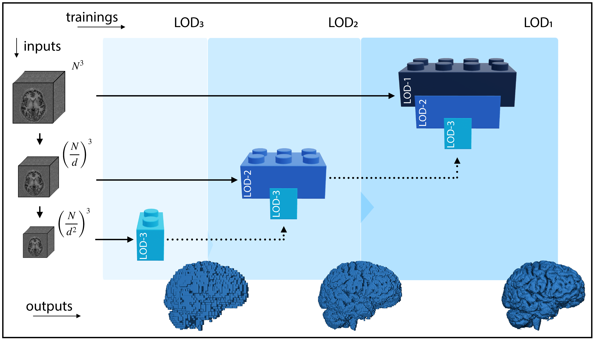

# Abstract

Many clinical and research studies of the human brain require accurate structural MRI segmentation.
While traditional atlas-based methods can be applied to volumes from any acquisition site, recent deep learning algorithms ensure high accuracy only when tested on data from the same sites exploited in training (*i.e.*, internal data). Performance degradation experienced on external data (*i.e.*, unseen volumes from unseen sites) is due to the inter-site variability in intensity distributions induced by different MR scanner models, acquisition parameters, and unique artefacts. To mitigate this site-dependency, often referred to as the *scanner effect*, we propose **LOD-Brain**, a 3D convolutional neural network with progressive levels-of-detail (LOD), able to segment brain data from any site. Coarser network levels are responsible for learning a robust anatomical prior helpful in identifying brain structures and their locations, while finer levels refine the model to handle site-specific intensity distributions and anatomical variations. We ensure robustness across sites by training the model on an unprecedentedly rich dataset aggregating data from open repositories: almost 27,000 T1w volumes from around 160 acquisition sites, at 1.5 - 3T, from a population spanning from 8 to 90 years old. Extensive tests demonstrate that **LOD-Brain** produces state-of-the-art results, with no significant difference in performance between internal and external sites, and robust to challenging anatomical variations. Its portability paves the way for large-scale applications across different healthcare institutions, patient populations, and imaging technology manufacturers. Code, model, and demo are available on the [project website](https://rocknroll87q.github.io/LOD-Brain/).

<p align="center">
  
<figcaption>Figure 1: LOD-Brain is a level-of-detail (LOD) network, where each LOD is a U-net which processes 3D brain multi-data at a different scale. Lower levels learn a coarse and site-independent brain representation, while superior ones incorporate the learnt spatial context, and refine segmentation masks at finer scales. Examples of outputs (grey matter renderings) at different LODs are shown in blue at the bottom.</figcaption>
</p>


<hr>
# Results

Visit the result [page](https://rocknroll87q.github.io/LOD-Brain/results#top) for more results.


<hr>
# Usage

Visit the relative [page](https://rocknroll87q.github.io/LOD-Brain/usage) to learn how to use `LOD-Brain` from source code, docker, or singularity.

<hr>
# Citation

If you find this work useful, please consider citing our paper:

```
@article{SVANERA2024103090,
	title = {Fighting the scanner effect in brain MRI segmentation with a progressive level-of-detail network trained on multi-site data},
	journal = {Medical Image Analysis},
	volume = {93},
	pages = {103090},
	year = {2024},
	issn = {1361-8415},
	doi = {https://doi.org/10.1016/j.media.2024.103090},
	url = {https://www.sciencedirect.com/science/article/pii/S136184152400015X},
	author = {Michele Svanera and Mattia Savardi and Alberto Signoroni and Sergio Benini and Lars Muckli},
	keywords = {3D segmentation, Brain MRI, Progressive level-of-detail architecture, Multi-site learning},
```


<hr>
# Acknowledgments

This was supported from the EU Horizon 2020 Framework Programme for Research and Innovation under the Specific Grant Agreement No. 945539 (Human Brain Project SGA3). 
We thank Ibrahim Hashim and Simona Fratus for assistance with the database creation Mrs Frances Crabbe for useful feedback on manual segmentation.

We recognise the priceless contribution made by several openly available MRI datasets: OpenNeuro ([https://openneuro.org/]()), ABCD ([https://abcdstudy.org/]()), Open Science Framework ([https://osf.io/]()), the Human Connectome Project ([http://www.humanconnectomeproject.org/]()), the NIMH Data Archive ([https://nda.nih.gov/]()), the Open Access Series of Imaging Studies (OASIS) ([https://www.oasis-brains.org/]()), Mindboggle101 ([https://mindboggle.info/data.html]()), the evaluation framework for MR Brain Image Segmentation (MRBrainS) ([https://mrbrains18.isi.uu.nl/]()), the the Amsterdam Open MRI Collection (AOMIC) ([https://nilab-uva.github.io/AOMIC.github.io/]()), the Internet Brain Segmentation Repository (IBSR) ([https://www.nitrc.org/projects/ibsr]()), and the great contribution provided by the International Neuroimaging Datasharing Initiative (INDI) ([https://fcon_1000.projects.nitrc.org/]()), with many datasets, including but not limited to, the Nathan Kline Institute-Rockland Sample (NKI-RS) ([http://fcon_1000.projects.nitrc.org/indi/enhanced/]()), the Information eXtraction from Images project (IXI) ([https://brain-development.org/ixi-dataset/]()), the Autism Brain Imaging Data Exchange (ABIDE) ([http://fcon_1000.projects.nitrc.org/indi/abide/]()), and the Attention Deficit Hyperactivity Disorder (ADHD) ([https://fcon_1000.projects.nitrc.org/indi/adhd200/]()).
The ABCD data repository grows and changes over time. The ABCD data used in this report came from DOI=10.15154/1528529. DOIs can be found at [https://dx.doi.org/10.15154/1528529](http://dx.doi.org/10.15154/1528529).


<hr>

