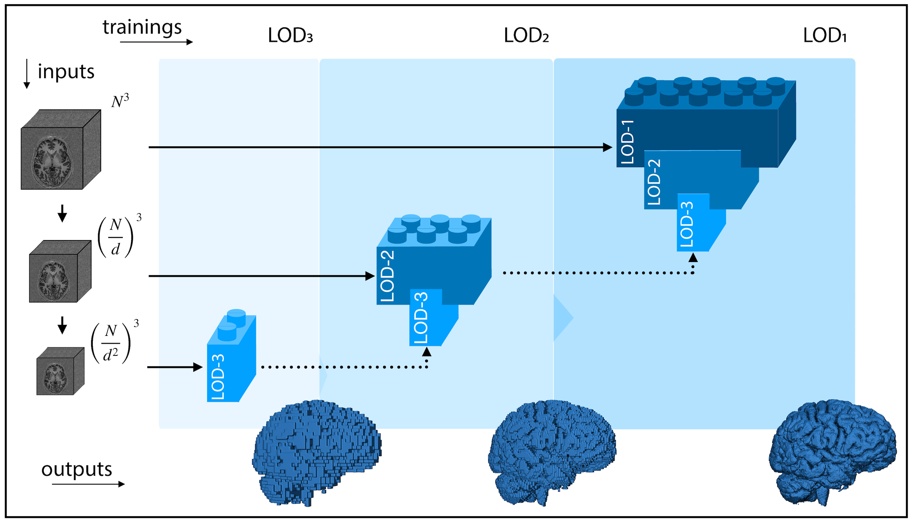

<hr>
# Abstract

Many clinical and research studies of the human brain call for an accurate automated MRI segmentation.
Despite the advances granted by deep learning techniques, these methods are usually trained with data from single or few MRI sites or vendors. 
This severely limits the model’s ability to generalise well to external data i.e., new volumes from unseen datasets.
Thanks to the increasing availability of open MRI brain data, we aggregate an unprecedented set of 27,000 T1w volumes from 155 acquisition sites, at 1.5 and 3T, from a population spanning from 8 to 90 years old.
To learn from this broad range of variability, as for scanner noise, vendors, brain morphology, etc., we exploit **LOD-Brain**, a 3D progressive level-of-detail (LOD) network.
Coarser levels are responsible to learn a robust brain prior useful for identifying main brain structures and their locations; finer levels, instead, progressively refine the model to handle site-specific intensity distributions, artifacts, and inter-subject anatomical variations.
Thanks to an extremely low number of parameters if compared to other competitors, **LOD-Brain** returns accurate 3D segmentation masks in few seconds.
Extensive tests demonstrate that our method produces superior results with respect to state-of-the-art solutions, without the need of retraining nor fine-tuning when used on external data. 
The easy portability offered by **LOD-Brain** opens the way for large scale application in both research and clinical settings across different healthcare institutions, patient populations, and imaging technology manufacturers.


<p align="center">
  
</p>

<hr>
# DEMO

TODO

<hr>
# Dataset

Visit the relative [page](https://rocknroll87q.github.io/LOD-Brain/dataset) for a better understanding of the datasets used in this work.

<hr>
# Results

TODO

<hr>
# Code

Visit the Github [page](https://github.com/rockNroll87q/LOD-Brain/) for the source code.

<hr>
# Usage

Visit the relative [page](https://rocknroll87q.github.io/LOD-Brain/usage) to learn how to use `LOD-Brain` from source code, docker, or singularity.

<hr>
# Citation

If you find this work useful, please consider citing our paper:

```
TO ADD
```


<hr>
# Acknowledgments

TO ADD


<hr>

