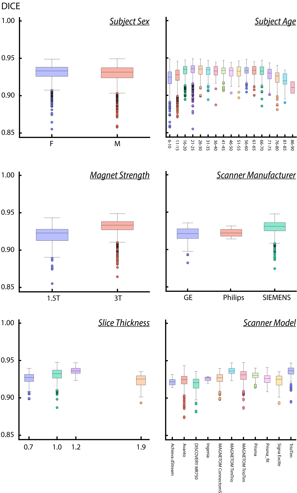

[<-- main page](https://rocknroll87q.github.io/LOD-Brain/)

## Segmentation result

We select some volumes with the worst numerical result (max one for dataset), and display FreeSurfer and LOD-Brain segmentation masks overlayed to the correspondent T1w image. Despite low performance, the segmentation mask returned by LOD-Brain shown less errors with respect to Freesurfer, which is indicative of low-quality ground-truth masks.

* Click the buttons to load test images.
* Press `v` to toggle between views.
* Press `c` for interactive clip plane.
* Move the crosshairs: left mouse click and drag.
* Slice scrolling: mouse or touch pad scroll up and down.
* Set opacity and gamma with sliders below.

<section>

  

	  
Test images:

	  

	  
  

  

    seg opacity<input type="range" min="1" max="255" value="75" class="slider" id="alphaSlider">
  

  

    T1 gamma  <input type="range" min="10" max="400" value="100" class="slider" id="gammaSlider">
  
 
  
  
  <label for="mask_to_show">Segmentation mask</label>
	<select name="myMask" id="mask_to_show">
	  <option value="LOD-Brain">LOD-Brain</option>
	  <option value="FreeSurfer">FreeSurfer</option>
	</select>
	

 
   
  

    <canvas id="gl1" height=640 width=640>
    </canvas>
  

    
</section>

## Bias results

Figure: Dice similarity coefficient for different groups based on demographics and technical characteristics. From top left to bottom right: sex, age, magnet strength, scanner manufacturer, slide thickness, scanner model. All results are obtained on the balanced testing set of 5949 volumes.

  

.

  <!--var maskToShow = document.getElementById("mask_to_show")
  maskToShow.onchange = function() {
    switch(document.getElementById("mask_to_show").value) {		case "LOD-Brain":
			let root = './results/';
			let img_mask = root + imgs[i] + '_pred.nii.gz';
			volumeList1[1].url = img_mask;
			break
		case "FreeSurfer":
			let root = './results/';
			let img_mask = root + imgs[i] + '_GT.nii.gz';			volumeList1[1].url = img_mask;
			break
	    }
		nv1.loadVolumes(volumeList1);
		nv1.updateGLVolume();	
	  }-->

